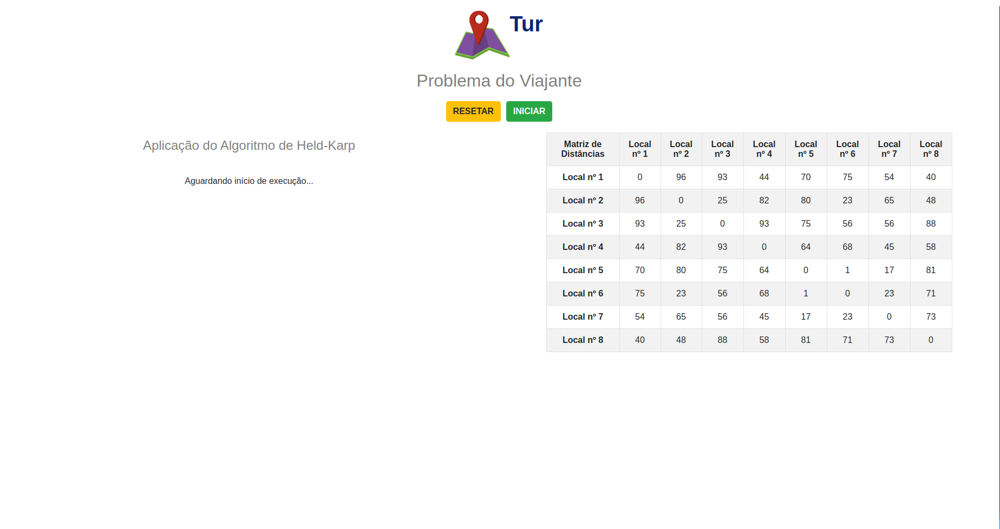
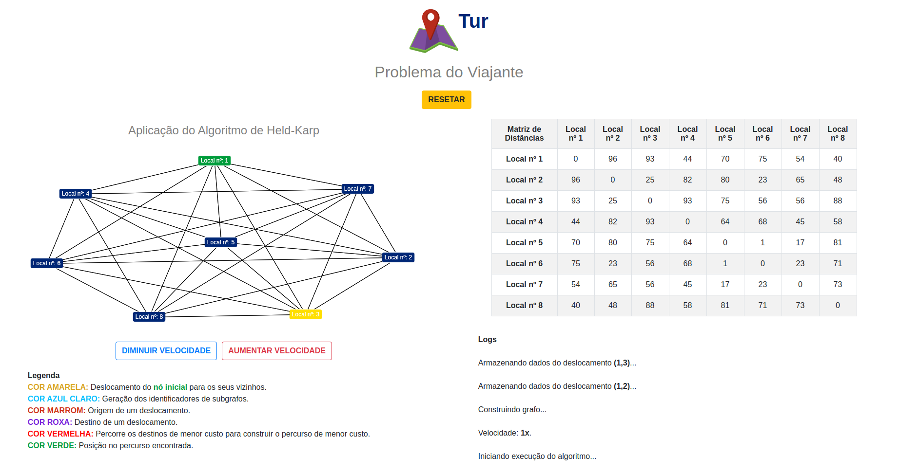
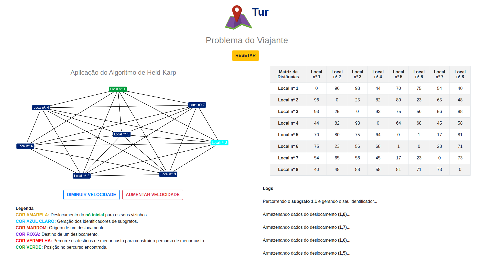
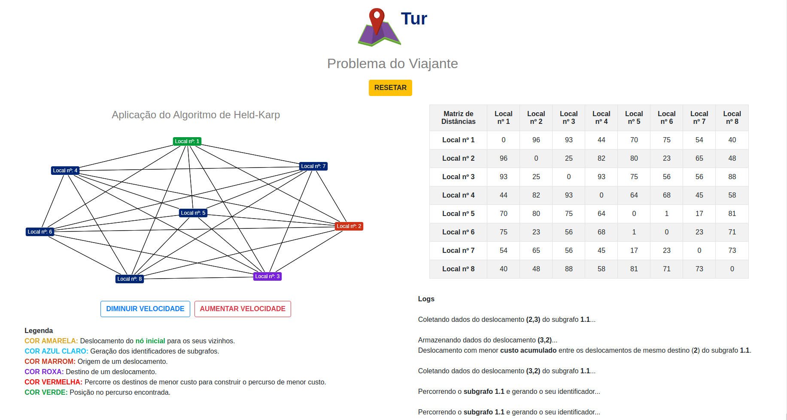
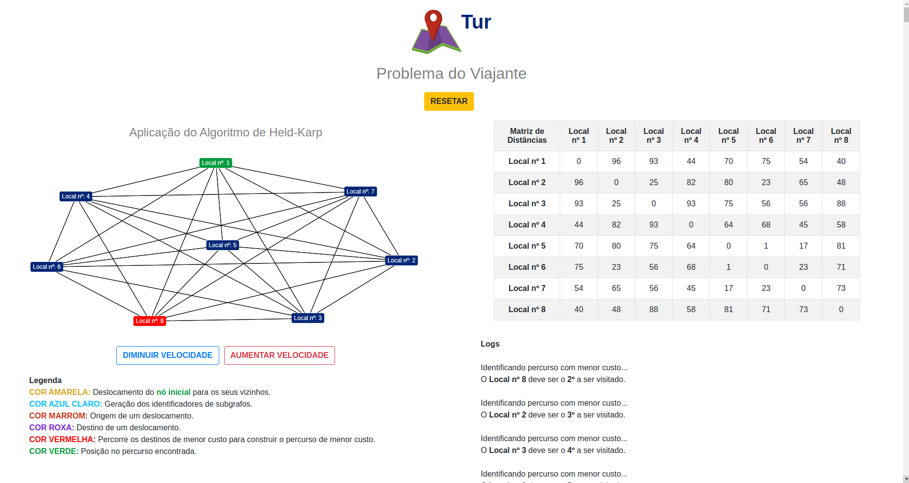
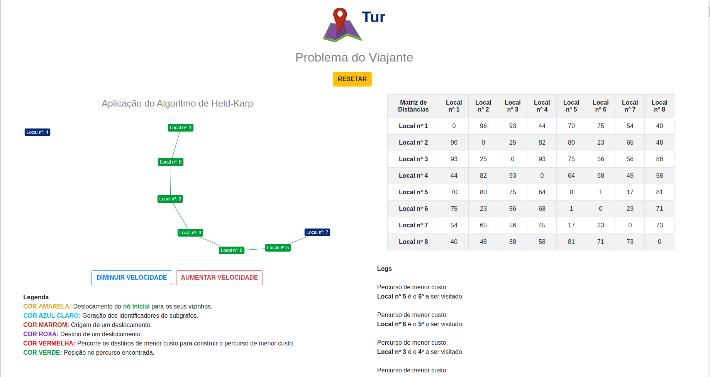
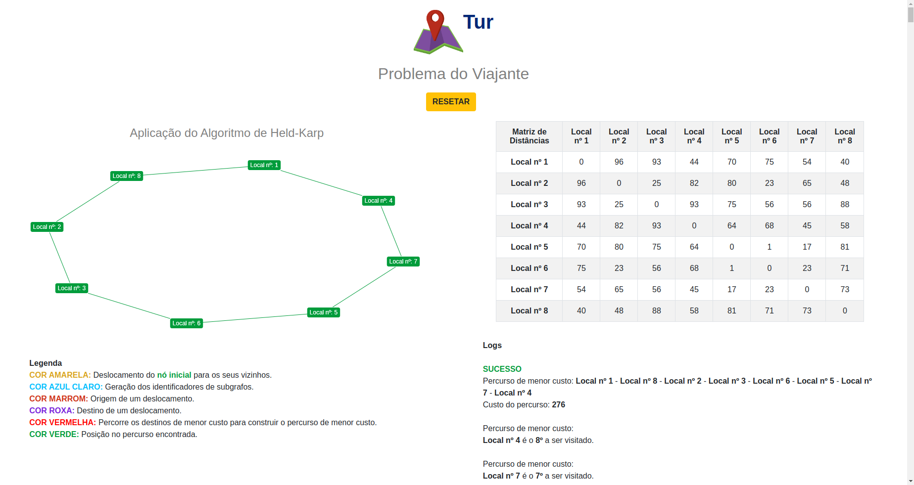

**!! Atenção: Renomeie o seu repositório para (Tema)_(NomeDoProjeto). !!** 

Temas:
 - Grafos1
 - Grafos2
 - PD
 - D&C
 - Greed
 - Final 
 
 **!! *Não coloque os nomes dos alunos no título do repositório*. Exemplo de título correto: Grafos2_Labirinto-do-Minotauro !!**
 
 (Apague essa seção)

# NomedoProjeto

**Número da Lista**: X<br>
**Conteúdo da Disciplina**: XXXXXXXXXX<br>

## Alunos
|Matrícula | Aluno |
| -- | -- |
| xx/xxxxxx  |  xxxx xxxx xxxxx |
| xx/xxxxxx  |  xxxx xxxx xxxxx |

## Sobre 
Descreva os objetivos do seu projeto e como ele funciona. 

## Screenshots

### Página Inicial


### Execução Algoritmo

#### Deslocamentos Nó Inicial


#### Subgrafos


#### Deslocamentos Subgrafos


#### Percurso Menor Custo - Identificação


#### Percurso Menor Custo - Construção


#### Percurso Menor Custo



## Instalação 
**Linguagem**: Python3<br>

É necessário possuir o sistema de gerenciamento de pacotes **pip3**.

Se não possuir, no Ubuntu, rode o seguinte comando no terminal:

```
sudo apt-get install python3-pip
```

## Uso 

No terminal, primeiro instale os requisitos do projeto e depois execute o arquivo principal.

### Instalação dos requisitos

```
make install
```

### Execução do projeto

```
make run
```

## Outros 
Quaisquer outras informações sobre seu projeto podem ser descritas abaixo.


